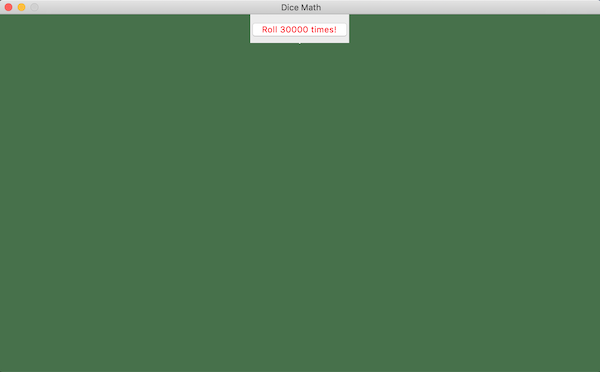
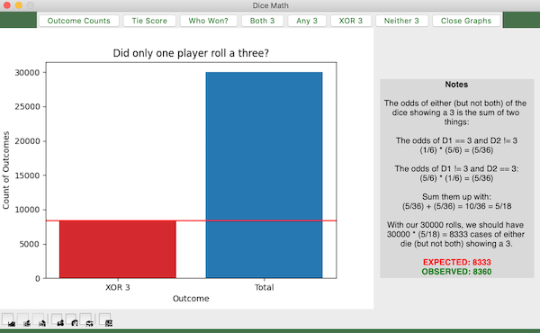
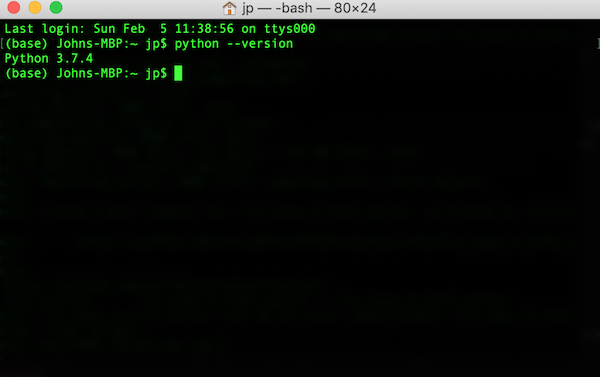

# DiceMath

Probability is simple, but sometimes not intuitive.  I wanted an app that would show my son that the mathematics of probability really work.  A dice rolling simulator seemed like a good starting place!  We roll the dice a few thousand times with one button click.  

Then, we view various results alongside math notes and example calculations.

## Installation

### Python
This is a Python application, so you'll need Python installed.  Check to see if it is already installed by opening a terminal window/command prompt and executing:
`python --version`

If python is installed, you should see something like:

If python is not installed, you can download it from 
[Python Download](https://www.python.org/downloads/)

### Clone the Repo
If you're reading this README, then you're already on GitHub so just click the "Code" button to see the options for downloading the repository.  If you're lazy like me, you didn't close the terminal you opened to check for Python, so you can just change to the directory in which you want to keep this repository:
`cd veriables_projects`

Then, download the project with:
`git clone https://github.com/veriables/DiceMath.git`

### Dependencies
This software uses a few libraries that might not be installed on your system.  Here's a list of them presented as a pip command that you can execute to install them:
`
pip3 install numpy Pillow tkinter matplotlib tkhtmlview
`

Once these are installed, you're ready to run the app!

## Running the app
1. Open a Terminal Window/Command Prompt
2. Switch into the directory that holds the project with: `cd ./veriables_projects/DiceMath;`
3. Use python to run the DiceRoller.py script: `python DiceMath.py`

## License
MIT License
